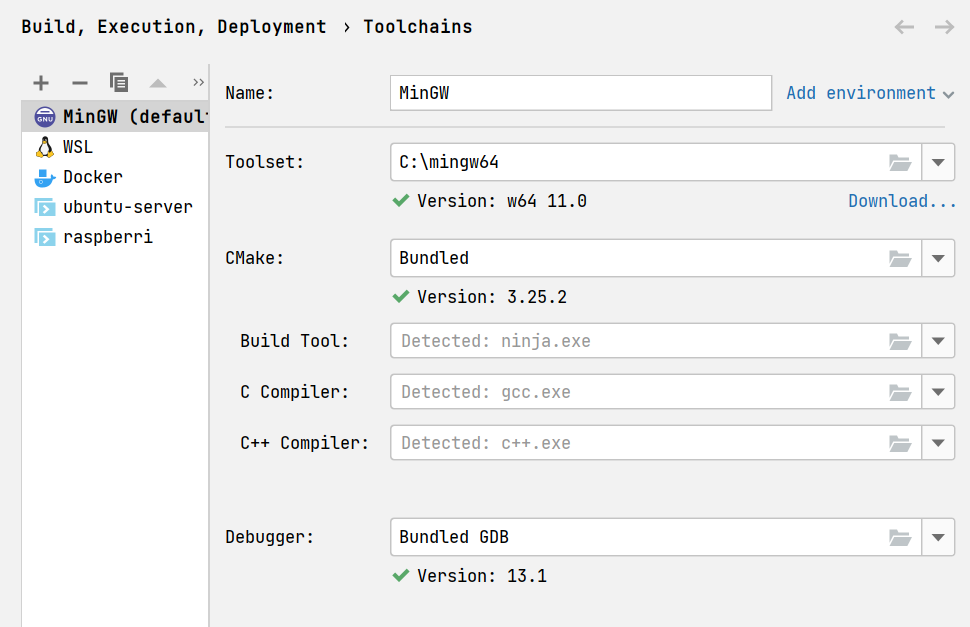
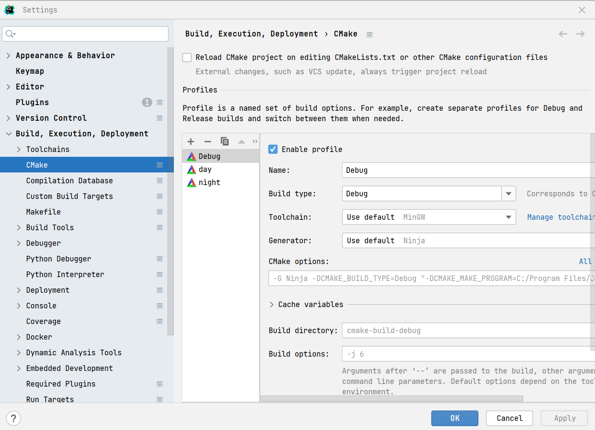
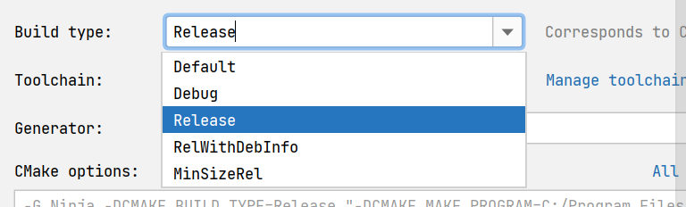
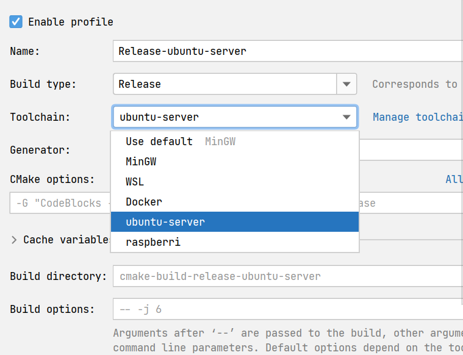
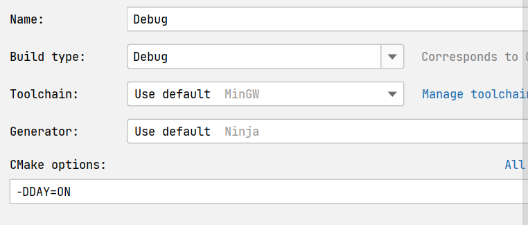
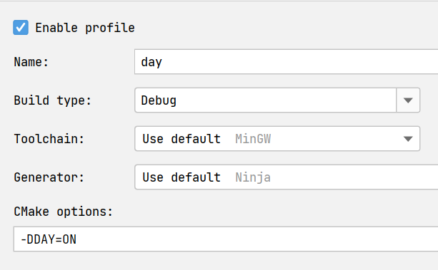

# Работа в CLion

Мы будем работать с различными *профилями* (вариантами) сборки.
Для этого в среде разработки предусмотрено удобное управление ими.

В основе работы в CLion лежат toolchains (тулчейны) и profiles (профили).

## Toolchains

Нажав `ctrl+alt+s`, перейдите в настройки.
Далее перейдите в блок `Build, Execution, Deployment`.
После этого необходимо выбрать `Toolchains`.

У вас откроется окно тулчейнов - на это можно смотреть как на "системы", в которых происходит сборка.

> Как показано на изображении, это может быть как основная система (например, MinGW для Windows), так и контейнеры Docker, удаленные сервера с доступом по ssh, виртуальные машины и прочее

## Profiles

В том же блоке настроек выберете пункт `CMake`.

> Скорее всего вы увидите единственный профиль - `debug`

Теперь же создадим новый профиль - конфигурацию сборки.

Для этого надо нажать на `+`. Так у вас появится новый профиль сборки.
Начнем настраивать.

1. Выберем тип сборки

2. Выберем тулчейн

3. Настроим опции сборки

> Вам понадобится два профиля: `-DDAY=ON` и `-DNIGHT=ON`

4. Дадим понятное название профилю

---

*P.S. К сожалению, CLion не хранит данные настройки в конфигуровочных файлах, которые мы могли бы прикрепить, поэтому вам придется самим повторить действия из гайда для настройки.*

