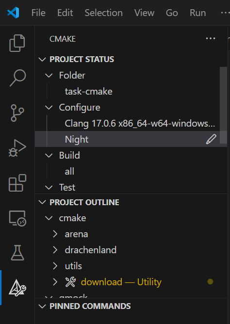
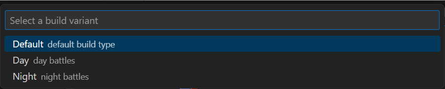

# Работа в VS Code

Мы будем работать с различными *профилями* (вариантами) сборки.
Для этого в среде разработки предусмотрено удобное управление ими.

Советуем установить следующий плагин `CMake Tools`

В файле [`cmake-variants.yaml`](../cmake-variants.yaml) уже для вашего удобства настроены три профиля сборки:
* **Default** - обычный режим сборки, без каких-либо опций
* **Day** - режим сборки, в котором есть `-DDAY=ON` (для дневных поединков)
* **Night** - режим сборки, в котором есть `-DNIGHT=ON` (для ночных поединков)

Откройте в боковой панели вкладку **CMake**. Там вы увидите секцию `Configure`:

> При первом запуске у вас будет выбран дефолтный профиль `Default`

Чтобы сменить профиль, нажмите на карандаш (он появится при наведении курсора на строку).

У вас раскроется окно, в котором можно выбрать профиль сборки.
Так у вас будет возможность менять варианты сборки без особых усилий.
